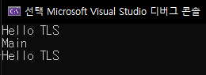

# TLS Callback

# **INDEX**

**1. [TLS Callback](#TLS-Callback)**


# **TLS Callback**

TLS 콜백 함수는 프로세스의 Thread가 실행/종료 될 때마다 자동으로 호출되는 콜백함수이다.

다음과 같이 main thread의 실행과 종료될 때 Tls_Callback()이 호출된다.

```c++
#include <windows.h>
#include <stdio.h>

void WINAPI Tls_Callback(PVOID THandle, DWORD Reason, PVOID REserved) {
	printf("Hello TLS\n");
}

#pragma comment (linker, "/INCLUDE:_tls_used")
#pragma comment (linker, "/INCLUDE:p_tls_callback1")
#pragma const_seg(push)
#pragma const_seg(".CRT$XLAAA")
#ifdef _M_AMD64
EXTERN_C const PIMAGE_TLS_CALLBACK p_tls_callback1 = Tls_Callback;
#endif
#ifdef _M_IX86
EXTERN_C PIMAGE_TLS_CALLBACK p_tls_callback1 = Tls_Callback;
#endif
#pragma const_seg(pop)

int main(void)
{
	printf("Main\n");
	return 0;
}
```

