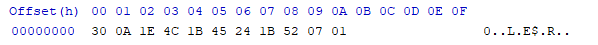

# XOR

# **INDEX**

**1. [XOR](#XOR)**


# **XOR**

수리 논리학에서 주어진 2개의 명제 가운데 1개만 참일 경우를 판단하는 논리 연산이다.

다음으로 파일의 내용을 XOR로 암호화 해보기 위하여 평문 텍스트를 생성하자.

* Hello World.txt

    Hello World

이후 다음의 소스를 컴파일 후 평문 텍스트와 같은 위치에 놓는다.

```c++
#include <windows.h>
#include <stdio.h>

int main(void)
{
    const char *XORKey              = "xor test key";
    const char *InputFileName       = ".\\Hello World.txt";
    const char *OutputFileName      = ".\\Hello World2.txt";
    int XORKeyLength                = strlen(XORKey);
    unsigned long InputFileLength   = 0;
    char ErrorBuffer[1024]          = { '\0' };
    char *InputFileData, *OutputFileData;    
    FILE *ReadFilePointer, *WriteFilePointer;
    errno_t err;

    err = fopen_s(&ReadFilePointer, InputFileName, "rb");
    if (err != 0 || ReadFilePointer == NULL) {
        strerror_s(ErrorBuffer, sizeof(ErrorBuffer), err);
        printf("cannot open file '%s' : %s\n", InputFileName, ErrorBuffer);
        return 0;
    }

    fseek(ReadFilePointer, 0, SEEK_END);
    InputFileLength = ftell(ReadFilePointer);
    rewind(ReadFilePointer);

    InputFileData   = (char*)malloc(sizeof(char) * InputFileLength);
    if (InputFileData == NULL) {
        fclose(ReadFilePointer);
        return 0;
    }

    if (fread(InputFileData, 1, InputFileLength, ReadFilePointer) != InputFileLength) {
        free(InputFileData);
        fclose(ReadFilePointer);
        return 0;
    }
    fclose(ReadFilePointer);

    err = fopen_s(&WriteFilePointer, OutputFileName, "wb");
    if (err != 0 || WriteFilePointer == NULL) {
        strerror_s(ErrorBuffer, sizeof(ErrorBuffer), err);
        printf("cannot open file '%s' : %s\n", OutputFileName, ErrorBuffer);
        free(InputFileData);
        return 0;
    }

    OutputFileData = (char*)malloc(sizeof(char) * InputFileLength);
    if (OutputFileData == NULL) {
        free(InputFileData);
        fclose(WriteFilePointer);
        return 0;
    }

    for (int i = 0; i < InputFileLength; i++) OutputFileData[i] = InputFileData[i] ^ XORKey[i % XORKeyLength];
    rewind(WriteFilePointer);
    fwrite(OutputFileData, 1, InputFileLength, WriteFilePointer);
    fclose(WriteFilePointer);

    free(InputFileData);
    free(OutputFileData);
    fclose(WriteFilePointer);
	return 0;
}
```

해당 소스를 실행하면 Hello World가 다음과 같이 변환되어 Hello World2.txt로 저장된다.

